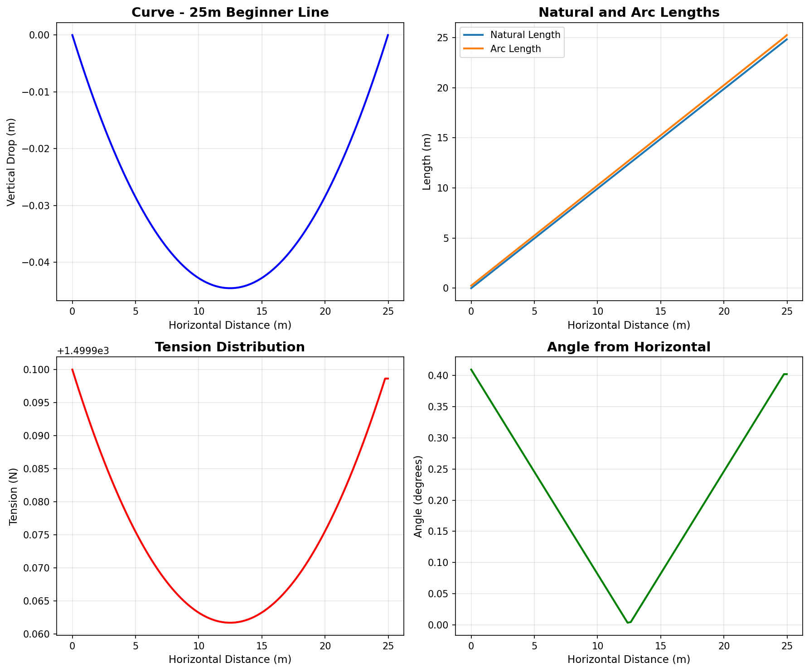
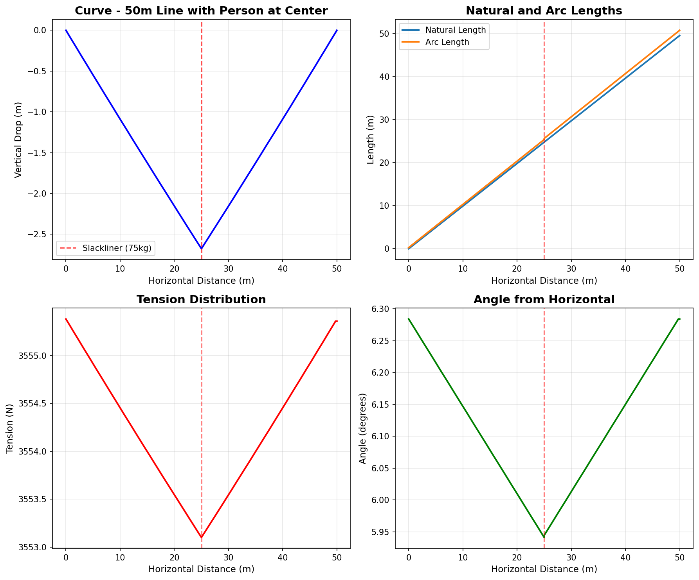
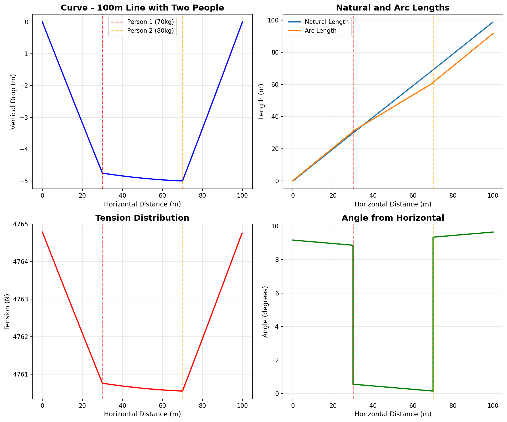
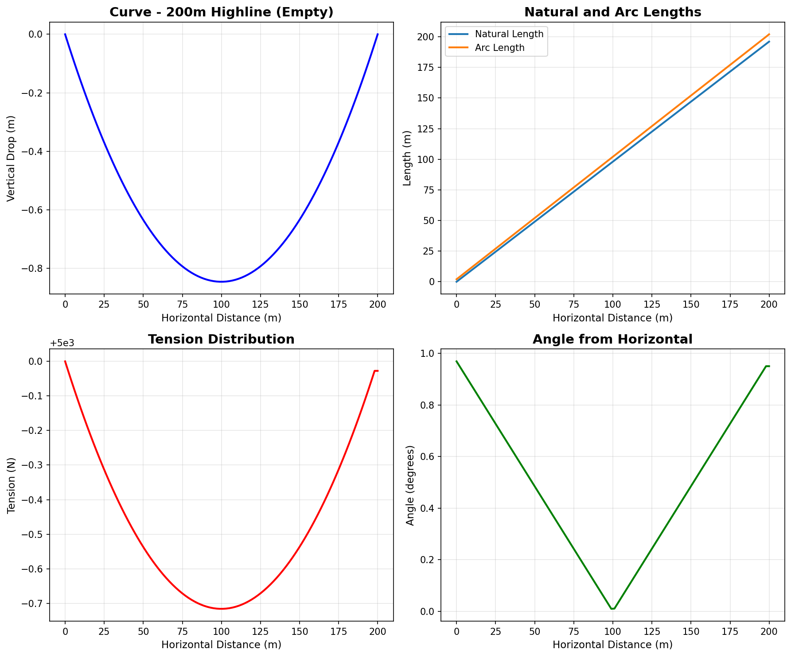

# Slackline Physics Simulator

A Lagrangian-mechanical physics simulator for elastic slacklines, built with Python. This project models the behavior of slacklines (elastic tension ropes used in slacklining) under various physical conditions, including multiple slackliners, different tensions, and varying gap lengths.

## Overview

This simulator uses **variational calculus** (Euler-Lagrange equations) to model slacklines as elastic continua, accounting for:
- Gravity effects (mass per meter of webbing)
- Elastic tension (stiffness parameter K)
- Anchor tensions and angles
- Point masses (slackliners) as discontinuities in the system

The physics engine computes the 3D shape/curve of a slackline and provides detailed information about tension, angle, drop, and arc length at each point along the gap.

## Features

- **High-level Python API** for easy slackline modeling
- **REST API server** (Flask) for remote access
- **Multiple integration methods**: length-tension solver, natural-length solver
- **Multi-slackliner support**: Model multiple people on the line simultaneously
- **Visualization tools**: Built-in plotting with matplotlib
- **JSON serialization**: Easy data exchange and storage

## Installation

This project uses [Poetry](https://python-poetry.org/) for dependency management.

### Prerequisites

- Python 3.10
- Poetry (for dependency management)

### Setup

```bash
# Clone the repository
git clone <repository-url>
cd slackline

# Install dependencies
poetry install

# Activate the virtual environment
poetry shell
```

## Quick Start

### Python API

```python
from src.api import Constraints, Rig
import matplotlib.pyplot as plt

# Create a slackline configuration
constraints = Constraints(gap_length=50, anchor_tension=2000)

# Add a slackliner (position in meters, mass in kg)
constraints.add_slackliner(position=25, mass=75)

# Compute the rig
rig = constraints.rig()

# Access results
print(f"Maximum drop: {min(rig.y):.2f}m")
print(f"Maximum tension: {max(rig.T):.2f}N")

# Plot results
rig.plot()
plt.show()
```

### Flask REST API

Start the server:

```bash
python src/server.py
```

Send a POST request to `/rig` with JSON constraints:

```bash
curl -X POST http://localhost:5000/rig \
  -H "Content-Type: application/json" \
  -d '{
    "gap_length": 50,
    "anchor_tension": 2000,
    "slackliners": [[25, 75]]
  }'
```

## Example Simulations

### 1. Short Beginner Line (25m)

A short slackline setup typical for beginners, with 1500N standing tension and no slackliners.



**Configuration:**
- Gap length: 25m
- Anchor tension: 1500N
- Slackliners: None

**Key observations:**
- Shallow catenary curve with minimal sag
- Relatively uniform tension distribution
- Low angles at the anchors
- Suitable for learning basic balance

### 2. Medium Line with One Person (50m)

A 50m slackline with a single 75kg slackliner at the center position.



**Configuration:**
- Gap length: 50m
- Anchor tension: 2000N (standing)
- Slackliner: 75kg at 25m position

**Key observations:**
- Visible discontinuity in tension at the slackliner's position
- Increased sag at the center due to the person's weight
- Tension spike where the slackliner stands (~25kN peak)
- Arc length differs significantly from natural length under load

### 3. Long Line with Two People (100m)

A 100m longline with two slackliners at different positions.



**Configuration:**
- Gap length: 100m
- Anchor tension: 3000N (standing)
- Slackliners: 70kg at 30m, 80kg at 70m

**Key observations:**
- Two distinct tension spikes at slackliner positions
- Asymmetric curve due to different masses and positions
- Complex interaction between multiple point loads
- Demonstrates the solver's ability to handle multiple boundary conditions

### 4. Extreme Highline (200m)

A very long highline setup with high tension and no slackliners - representing extreme conditions.



**Configuration:**
- Gap length: 200m
- Anchor tension: 5000N
- Slackliners: None

**Key observations:**
- Significant catenary sag even with high tension
- Self-weight of the line becomes the dominant factor
- Large vertical drop (multiple meters)
- Demonstrates the elastic behavior over long spans

## API Reference

### Constraints Class

The `Constraints` class describes the physical properties of a slackline setup.

```python
Constraints(
    slackline=dyneemite_pro,  # Slackline specification
    gap_length=100,            # Gap length in meters
    anchor_tension=1000        # Standing anchor tension in Newtons
)
```

**Methods:**
- `add_slackliner(position, mass)`: Add a slackliner to the line
  - `position`: Horizontal position in meters
  - `mass`: Mass in kilograms
- `rig()`: Compute and return a `Rig` object with results
- `to_json()`: Export configuration as JSON
- `from_json(json)`: Import configuration from JSON

### Rig Class

The `Rig` class contains the computed results as NumPy arrays.

**Attributes:**
- `x`: Horizontal distance along the gap (m)
- `n(x)`: Natural length of the slackline (m)
- `l(x)`: Arc length of the slackline (m)
- `y(x)`: Vertical drop of the slackline (m)
- `T(x)`: Tension in the slackline (N)
- `A(x)`: Angle of the slackline (degrees)

**Methods:**
- `plot()`: Create a matplotlib figure with all curves
- `to_dict()`: Export results as dictionary
- `to_json()`: Export results as JSON
- `from_json(json)`: Import results from JSON

## Technical Details

### Physics Model

The simulator uses the **Euler-Lagrange equations** from variational calculus to derive the equations of motion for the slackline. The Lagrangian includes:

- **Gravitational potential energy**: `U = m*g*y` (webbing self-weight)
- **Elastic potential energy**: `U_elastic = (K/2)*(dl/dn - 1)^2` (Hooke's law)
- **Kinetic energy**: Zero (static equilibrium)

The system is solved as a boundary value problem using scipy's RK45 ODE integrator.

### Slackline Specifications

The default slackline is "Dyneemite Pro" with:
- Mass per meter: `m = 0.115 kg/m`
- Stiffness: `K = 40000 N`
- Gravity: `g = 9.81 m/s²`

Custom slacklines can be defined using the `Slackline` class.

### Project Structure

```
slackline/
├── src/
│   ├── core/
│   │   ├── integrator.py      # Numerical integration engine
│   │   ├── calculus.py         # Symbolic Euler-Lagrange solver
│   │   ├── lagrangians.py      # Physics Lagrangians
│   │   └── slacklines.py       # Slackline specifications
│   ├── api.py                  # High-level Python API
│   └── server.py               # Flask REST API server
├── test/                       # Test directory
├── pyproject.toml              # Poetry configuration
└── README.md                   # This file
```

## Dependencies

- **scipy** (^1.9.3) - Numerical ODE solving
- **numpy** (^1.23.4) - Array operations
- **sympy** (^1.11.1) - Symbolic mathematics
- **matplotlib** (^3.6.2) - Plotting and visualization
- **Flask** (^2.2.2) - Web framework for REST API
- **findiff** (^0.9.2) - Finite difference computations
- **python-box** (^7.0.0) - JSON utilities

## Development

Run tests:
```bash
poetry run pytest
```

Start the development server:
```bash
poetry run python src/server.py
```

## Code Review Notes

### Strengths

1. **Clean Architecture**: Well-organized separation between physics engine, API, and server
2. **Robust Physics**: Uses proper variational calculus rather than simple approximations
3. **Caching Strategy**: Smart caching of Euler-Lagrange equations to avoid recomputation
4. **JSON Support**: Full serialization/deserialization for easy data exchange
5. **Type Safety**: Good use of named tuples and classes for structured data

### Areas for Potential Improvement

1. **Documentation**: Add docstrings to core physics modules (integrator.py, calculus.py)
2. **Error Handling**: Add validation and error messages for invalid configurations
3. **Testing**: Expand test coverage (currently minimal)
4. **Performance**: Consider adding progress callbacks for long integrations
5. **Visualization**: Add more plot types (3D visualization, animation support)
6. **Configuration**: Make solver parameters (tolerance, max iterations) configurable

## License

MIT License

## Author

Guy Paterson-Jones

## Version

0.2.0
