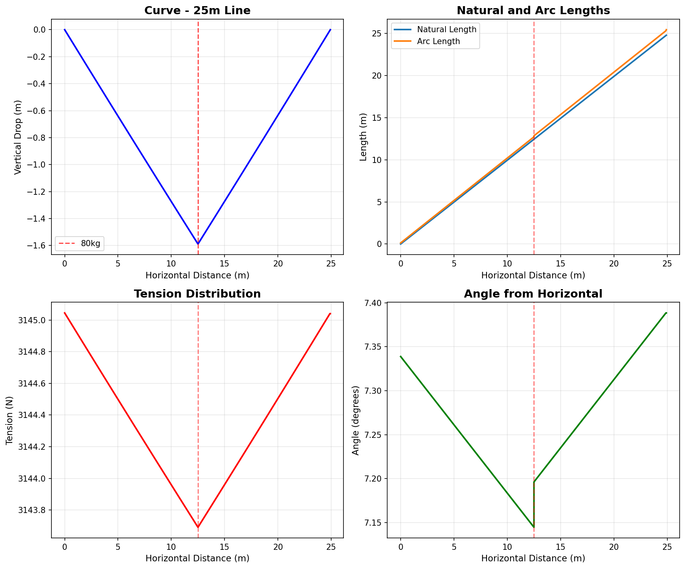
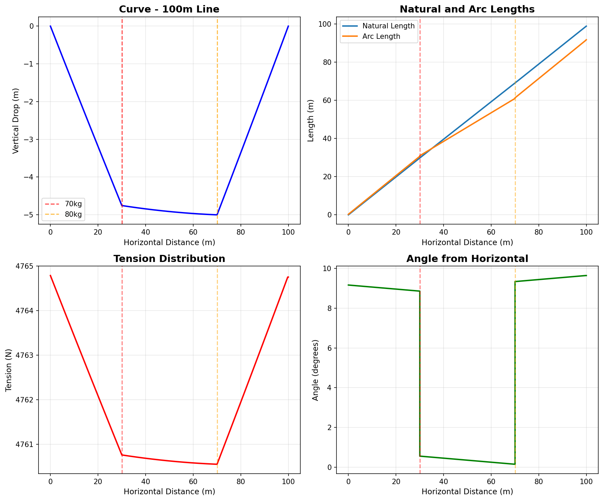
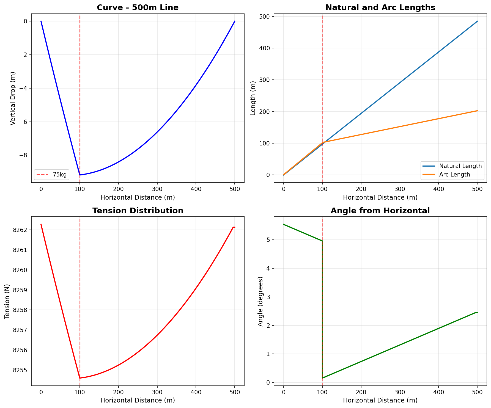

# Slackline Physics Simulator

Physics-based slackline simulator using Lagrangian mechanics to model elastic behavior under load.

## Installation

```bash
poetry install
```

## Usage

### Python API

```python
from src.api import Constraints

# Create a 50m slackline with 2000N standing tension
constraints = Constraints(gap_length=50, anchor_tension=2000)

# Add a 75kg person at the 25m mark
constraints.add_slackliner(position=25, mass=75)

# Compute the rig
rig = constraints.rig()

# Access results: x, y (curve), T (tension), A (angle), n/l (lengths)
print(f"Max drop: {min(rig.y):.2f}m, Max tension: {max(rig.T):.0f}N")
```

### Flask REST API

```bash
python src/server.py
```

```bash
curl -X POST http://localhost:5000/rig \
  -H "Content-Type: application/json" \
  -d '{"gap_length": 50, "anchor_tension": 2000, "slackliners": [[25, 75]]}'
```

## Examples

### 25m line with 80kg person at center



### 100m line with two people (70kg at 30m, 80kg at 70m)



### 500m line with 75kg person at 100m



## How it works

The simulator solves Euler-Lagrange equations for an elastic continuum accounting for:
- Webbing self-weight and elasticity (default: Dyneemite Pro, K=40kN, m=0.115kg/m)
- Point loads from slackliners as boundary conditions
- Gravity and catenary geometry

Uses scipy's RK45 ODE solver with symbolic calculus (SymPy) for equation derivation.
